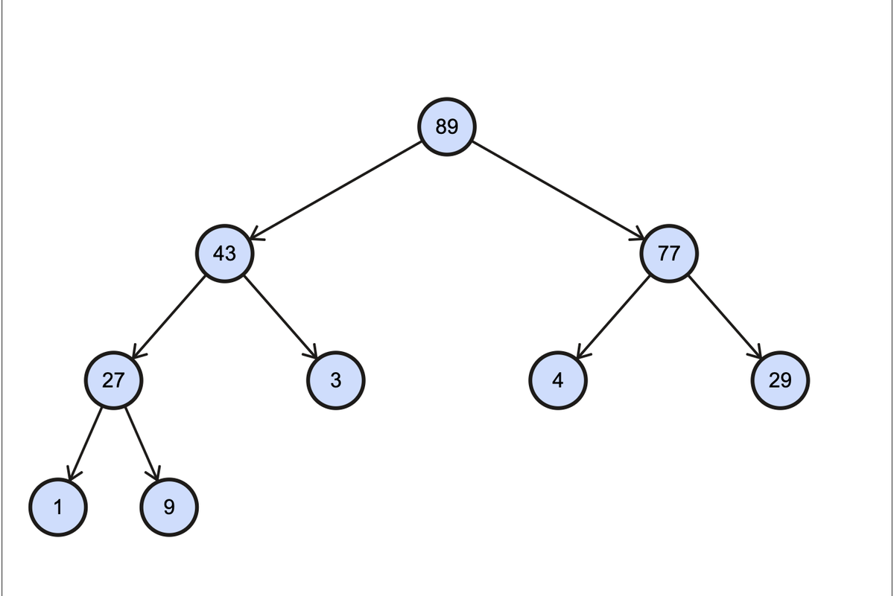
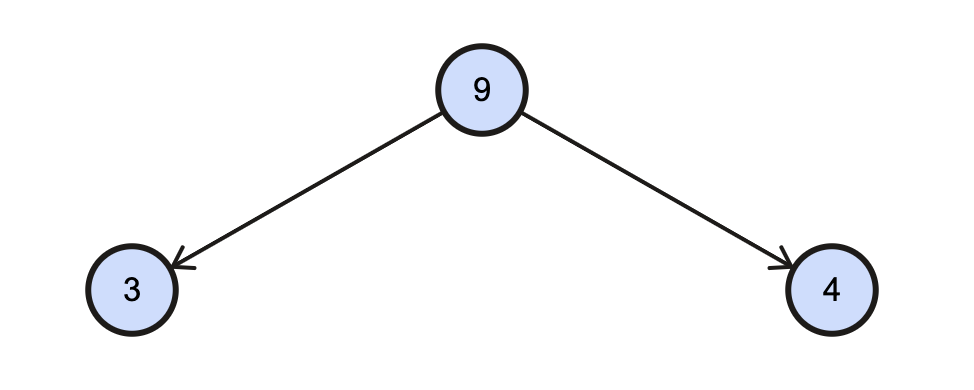
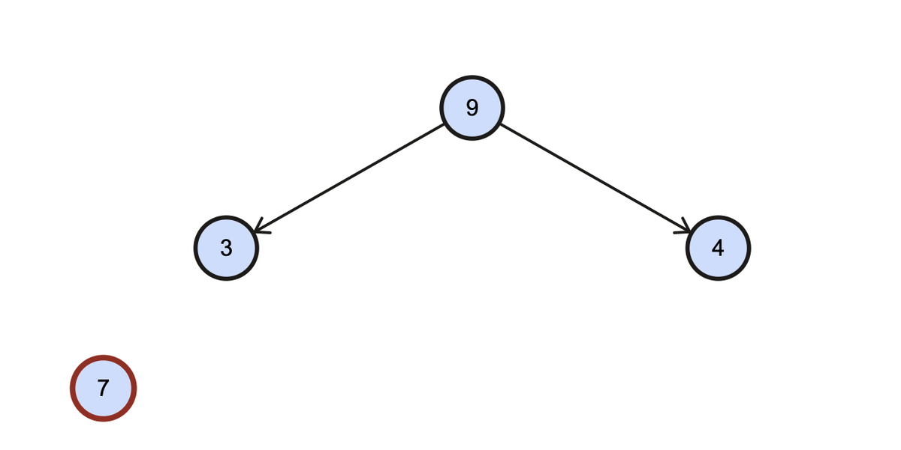
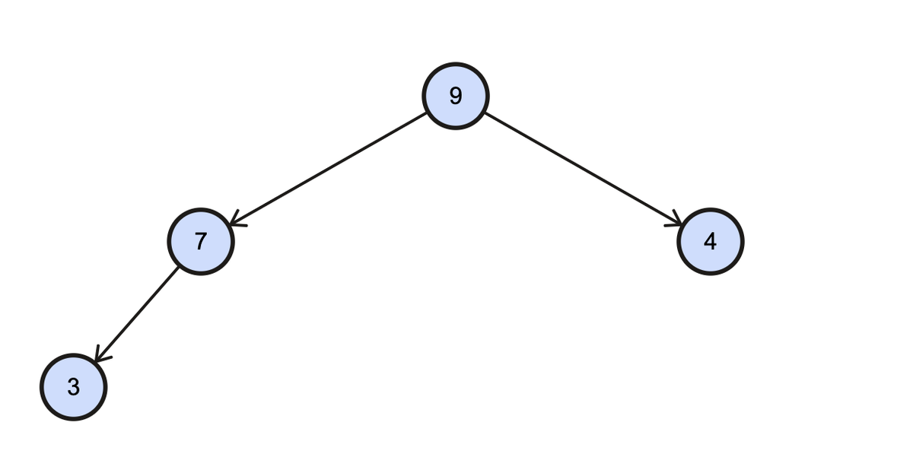
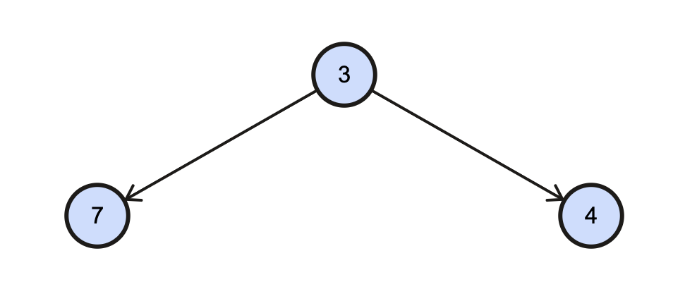
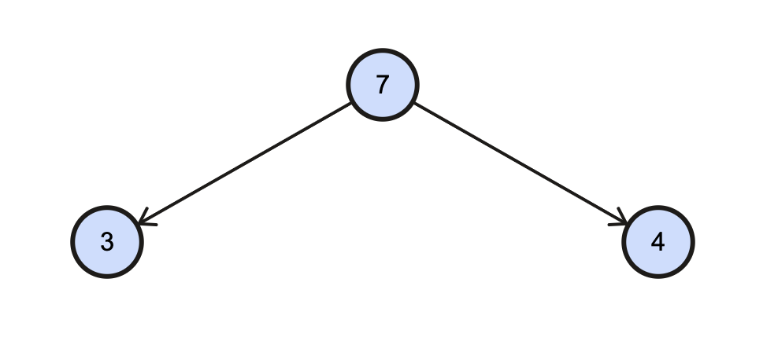

# Data Structure : 二叉堆 Binary Heap
## 一、概念 Concept
什么是**二叉堆**(Binary Heap)呢？它是一种特殊的完全二叉树。该完全二叉树有以下特点：

1. 任意一个父节点都一定比其子节点大（或小，如果是小根堆）。此称为“堆序性”，即使得操作可以被快速执行。
2. 它是一个完全二叉树。即树的非底层的部分被完全填满，底层从左至右依次填入。

下图是一个简单的二叉堆示例：



二叉堆具有任意父节点都一定比其子节点大的特性，所以时常用于实现排序、优先级等操作，而且其时间复杂度与空间复杂度都比较优秀。下面将详细介绍。
## 二、实现 Implement
二叉堆是一个特殊的完全二叉树，所以它可以**使用数组来实现**，通过数理关系找到对应的节点位置。

代码实现：

```kotlin
/** 左子节点位置 */
fun Int.indexOfLeft(): Int = 2 * this + 1

/** 右子节点位置 */
fun Int.indexOfRight(): Int = 2 * this + 2

/** 父节点位置 */
fun Int.indexOfParent(): Int = (this - 1) / 2
```

在堆的众多操作中，比较重要的是**插入**与**弹出**。

### 插入 Insert
为了实现堆序性，在插入元素时我们就应该开始考虑它插入的位置是否正确。因此，在插入元素后我们需要为该元素调整位置。

例如说当前我们有一个这样的大根堆（任意父节点都满足大于其子节点）：



现在要往堆中插入一个数据 7。该元素将经历以下过程：

1. 根据完全二叉树的特点，该 7 应该从左到右插入，即插入到数组的末尾（3 节点的左孩子）


2. 根据堆的特性，与父节点进行比对交换，以**保证满足堆序性**。若比父节点大则交换，否则则插入成功。*7 需要和它的父节点进行比对，以确保父节点为最大。所以经过和 3 的比对发现 7 比 3 大，所以 3 和 7 的位置就进行了互换。*


3. 重复执行步骤2，直到新插入元素比父节点小

所以最后插入元素后的堆长这样：


插入操作其主要耗时的点在于**需要和被插入元素的父节点进行比对并且在适合的时候交换**，假设当前堆中元素的数量为 N，而寻找合适位置最坏情况是插入的节点为所有元素中最大（或小，小根堆）的一个，需要把它所有的父节点都对比交换一遍。所以时间复杂度在最坏情况下应该是 O(log2N)。
代码实现

```kotlin
val heap: ArrayList<Int> = arrayListOf()

var size: Int = 0

/** 往堆中加入元素 */
fun put(element: Int) {
    // 在堆末插入元素
    if (heap.size <= size) {
        heap.add(element)
    } else {
        heap[size] = element
    }
    // 堆大小自增
    size++
    // 执行上浮操作以保证堆序性
    floatUp(size - 1)
}

/** 上浮操作 */
fun floatUp(index: Int) {
    var tempIndex = index
    // 从需要上浮位置开始往上遍历父节点，直到根节点
    while (tempIndex > 0) {
        if (type == HEAPTYPE.MAX) {
             // 大根堆的判定方式，与根节点作比较
            if (heap[tempIndex.indexOfParent()] < heap[tempIndex]) {
                swap(tempIndex, tempIndex.indexOfParent())
            } else {
                break
            }
        } else {
            // 小根堆的判定方式，与根节点作比较
            if (heap[tempIndex.indexOfParent()] > heap[tempIndex]) {
                swap(tempIndex, tempIndex.indexOfParent())
            } else {
                break
            }
        }
        // 交换后使用父节点位置继续往上遍历
        tempIndex = tempIndex.indexOfParent()
    }
}

/** 元素交换操作 */
private fun swap(first: Int, second: Int) {
    val temp = heap[first]
    heap[first] = heap[second]
    heap[second] = temp
}
```

### 弹出 Pop

弹出操作主要就是将堆顶元素弹出，而后将堆中最后元素放到堆顶，执行一遍下沉操作使得堆重新满足堆序性。
例如还是刚才操作后的堆：


当前堆顶元素为 9，弹出应该就是把 9 弹出，随后把元素提 3 到堆顶并针对 3 进行下沉操作。
1. 首先将 9 移除并将堆尾元素移动至堆顶


2. 针对 3 执行下沉操作：3 的左孩子（7）比右孩子（4）大，所以 3 与右孩子作比较，左孩子显然更大，所以两者进行互换：


弹出操作并没有利用任何外部空间，所以对空间复杂度为 O(0)。而其主要的时间复杂度在于下沉操作，最坏情况应该是：被替换到堆顶的元素是一个不比当下任何一个父节点大的数，需要下沉到堆的最底层，假设是一个节点个数为 N 的堆，其时间复杂度为 O(log2N)。


代码实现:

```kotlin
/** 获取当前堆中最顶部的元素 */
fun get(): Int? = if (size > 0) heap[0] else null

/** 获取当前堆中最顶部的元素，并将其从堆中弹出 */
fun pop(): Int? {
    // 需要被弹出的栈顶元素
    val result: Int? = get()
    if (result != null && size >= 1) {
        heap[0] = heap[size - 1]
        size--
        // 下沉
        sinkDown(0)
    }
    return result
}

/** 下沉操作 */
fun sinkDown(index: Int) {
    var tempIndex = index
    // 循环比较、交换直至找到合适位置
    while (tempIndex.indexOfLeft() < size) {
        var fitChild: Int
        if (type == HEAPTYPE.MAX) {
            // 找出最大的孩子节点
            fitChild =
                if (heap[tempIndex.indexOfLeft()] > heap[tempIndex.indexOfRight()] || tempIndex.indexOfRight() >= size) tempIndex.indexOfLeft() else tempIndex.indexOfRight()
            // 判断是否需要交换
            if (heap[tempIndex] < heap[fitChild]) {
                swap(tempIndex, fitChild)
            } else {
                break
            }
        } else {
            // 找出最小孩子节点
            fitChild =
                if (heap[tempIndex.indexOfLeft()] < heap[tempIndex.indexOfRight()] || tempIndex.indexOfRight() >= size) tempIndex.indexOfLeft() else tempIndex.indexOfRight()
            // 判断是否需要交换
            if (heap[tempIndex] > heap[fitChild]) {
                swap(tempIndex, fitChild)
            } else {
                break
            }
        }
        tempIndex = fitChild
    }
}

/** 元素交换操作 */
private fun swap(first: Int, second: Int) {
    val temp = heap[first]
    heap[first] = heap[second]
    heap[second] = temp
}

```

## 三、应用 Application
其实二叉堆的应用十分广泛，由于二叉堆有快速获取到堆中最大（小）元素的的特点，所以它可以用作排序（堆排序）、优先队列 等等

### 堆排序 Heap Sort
此处以升序排序为例：
1. 首先将数组构建成大根堆。
2. 将堆顶元素与堆末元素交换，堆大小 -1。
3. 重复步骤 2 直至堆大小为 1

经过上述步骤即可完成对一个数组的排序。其实利用的就睡堆顶总是最大（小）的特性。

### 优先队列 Priority Queue
在很多场景下都会遇到队列的情况。有部分场景中，元素各自都有其自身的优先级，如果使用二叉堆来实现，利用堆的堆序性可以使得我们可以在最短的时间内寻找到优先级最高（低）的元素并执行相关操作。
